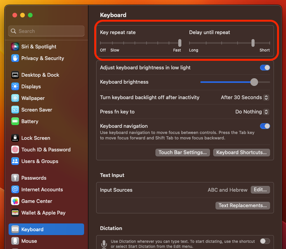
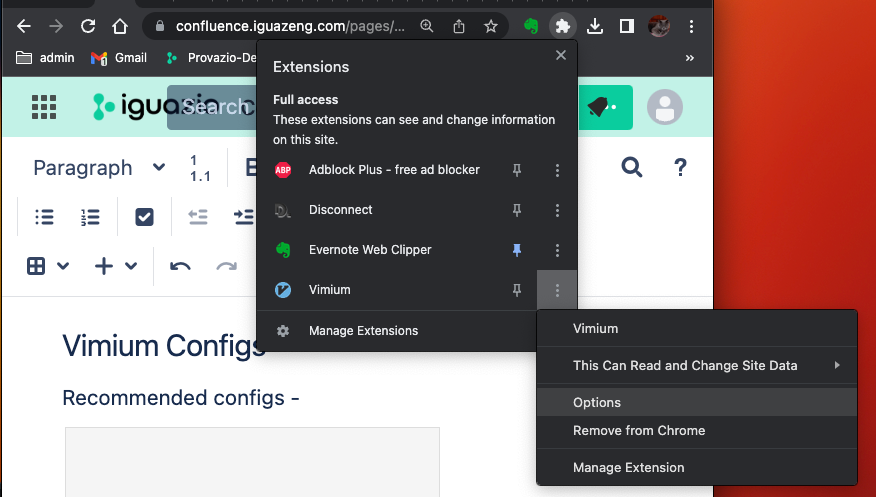
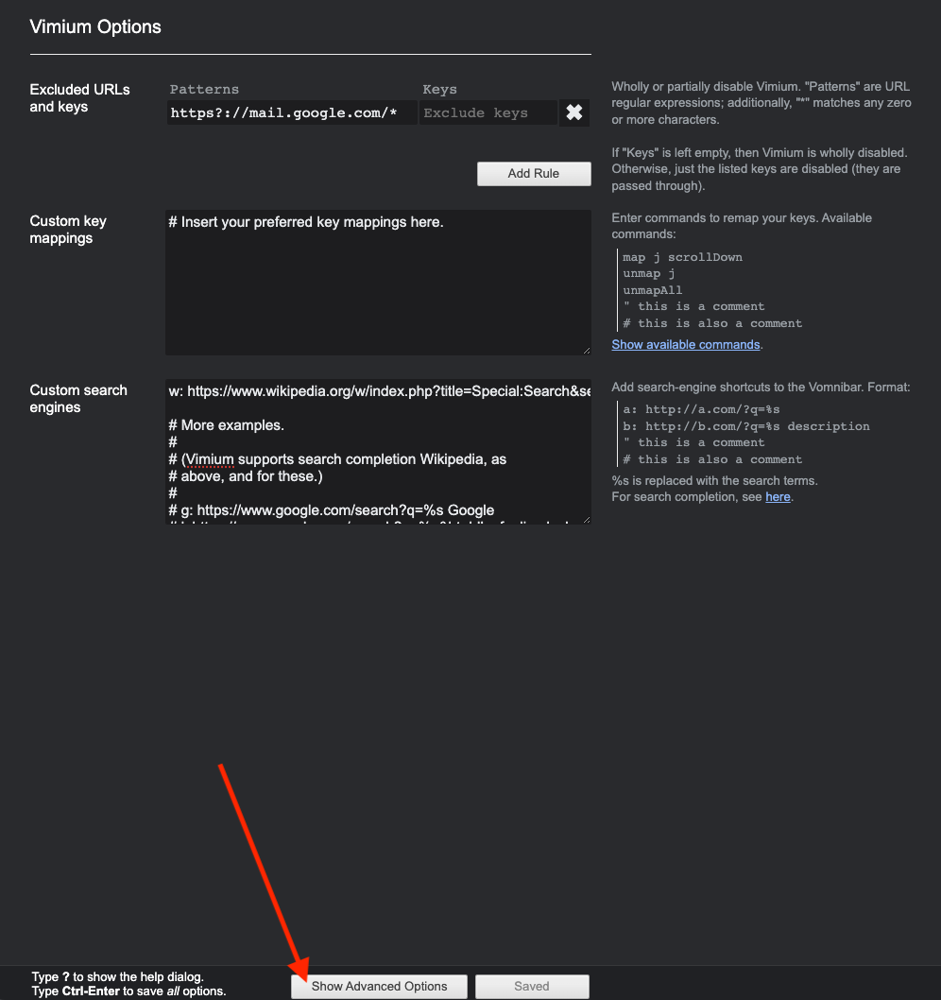
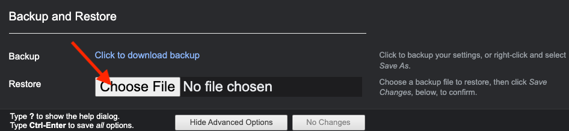
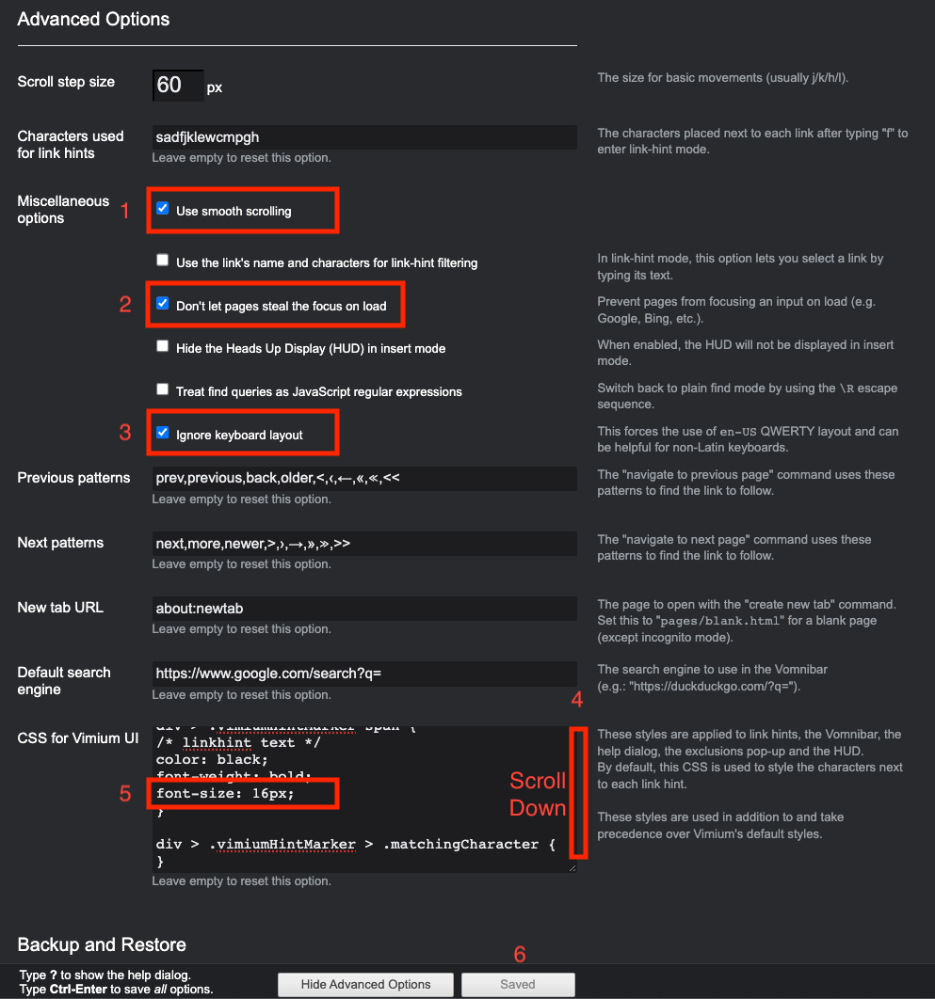
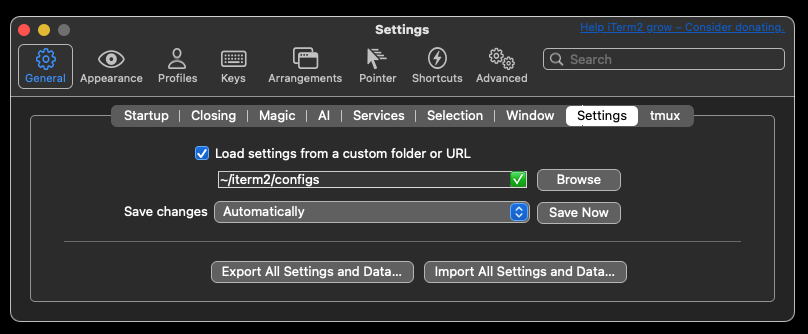
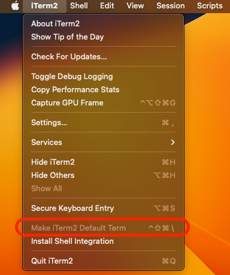

# macbook-setup

Upon getting a new Macbook, there's a laundry list of onboarding / setup / configuration steps. This document aims to ease the discovery process and get you going as painlessly as possible

# Who this page is for

## New Unix users

If you have little to no experience with any Unix-like system (macOS / Linux / HP OS / embedded systems / esoteric weirdness), only follow through the next section, OS Setup.

*DO NOT PROCEED past Browser Setup, Thar Be Dragons!*

After getting some hands-on XP with the command line, feel free to proceed, but tread lightly!

## New Macbook users

Working on a Macbook for the first time? *Congrats* and welcome to the journey 😃

Following the initial learning curve and around 1-2 years of use, you'll begrudgingly concede macOS isn't quite as offensive to your sensibilities anymore.
MacOS's saving grace is it's lineage of UNIX, making its shells close to Linux shells:

* (Almost) anything can be accessed via the terminal
* A vast package management system extends functionality easily
* Tools like SSH and CURL work out-of-the-box

## Veteran Unix users
We happily accept comments, corrections and contributions.
The Conclusion section is eagerly awaiting your input!

# Onwards!

Now then, *let's get this show on the road!*

# OS Setup
1. Set a reasonably typeable password for your user
2. Upgrade OS version to latest
3. Navigate to keyboard preferences, and set:
    * Key repeat rate (suggestion - set all the way to Fast)
    * Delay until repeat (suggestion - set to one before Short)



# Browser Setup
## Useful Browser Extensions
* [Vimium](https://github.com/philc/vimium) - Vim bindings and in-page search convenience for the browser. Available on Chrome Web Store and Firefox Addons Site.
* [Disconnect.me](https://chrome.google.com/webstore/search/disconnect.me) - removes silent trackers and third-party cookies

### Vimium Configs Walkthrough
After installing Vimium, tweaking it ever so slightly can go a long way.
Below is the config file for my personal preferences. It's pretty close to the default, just a bit crisper
[vimium_options.json](assets/vimium_options.json)

1. Download the file
2. Navigate to the vimium options menu. Screenshot below is for Chrome, but Firefox is similar



3. Click on the Show Advanced Options at bottom



4. Scroll down to the Backup and Restore section and click the Choose File button



5. Load the file
6. Verify configs (and amend according to your preferences)



7. Save changes and close


# Terminal Setup
## Installation
```shell
# Open terminal and verify your user directory
whoami # output should be <YOUR USER NAME>
pwd  # output should be "/Users/<YOUR USER NAME>"

# Install Xcode manager - xcode-select
xcode-select --install

# Install MacOS package manager - Homebrew
/bin/bash -c "$(curl -fsSL https://raw.githubusercontent.com/Homebrew/install/master/install.sh)"
 (echo; echo 'eval "$(/opt/homebrew/bin/brew shellenv)"') >> /Users/$(whoami)/.zprofile
 eval "$(/opt/homebrew/bin/brew shellenv)" 

# Install enhanced terminal - iTerm2
brew install iterm2 --cask
open -a iTerm .  
```
The last step triggers an OS Permissions Popup. After allowing, close the old terminal and continue in iTerm

## Config
In step (2) of the following setup you can download my personal config file. Below are some of its custom configs:
* Navigation
  * Option+arrow jumps words. In most guides online this is defined at the user profile level, which is puzzling, as I'd imagine most users would want this convenience. Here I've defined it at the global level
* Alternate screen mode (Any TUI - vim, screen, tmux etc)
  * Mouse wheel scrolls through console output instead of history (iTerm2 > Settings > Advanced > search "scroll wheel sends arrow keys" > No)
* Startup path
  * Opening a new window/tab goes to `~/code`
  * Opening a new split pane duplicates the current path
* Layout
    * Tabs are at the bottom (default is top)
    * Clock is displayed in the bottom left corner
    * Filter widget is next to the clock - super useful, as it works over ssh as well
* Profile
  * Scrollback is unlimited. The default is 1000 lines, which is almost never enough
  * Logs are saved to `/var/log/iterm2` - must set permissions to the folder (the `chown` in step (1)). If your machine has multiple users, or if you prefer to avoid touching permissions, set the log dir to your user-owned directory
  * Logs contain all inputs and outputs
* `Magic` (iTerm's special features) - instant replay buffer size increased to 40MB

1. Create paths and add permissions for the log folder
```shell
mkdir -p ~/iterm2/configs
mkdir -p ~/code
sudo mkdir -p /var/log/iterm2
sudo chown -R $(whoami) /var/log/iterm2
```
2. Download the config file into the iTerm2 configs folder [com.googlecode.iterm2.plist](assets/com.googlecode.iterm2.plist)
3. Load it from Settings → General → Settings → Check the “Load settings from Custom” checkbox



4. Make iTerm2 your default terminal in the OS



5. Read about shell integration and consider installing it
# Useful Tools
## Managers
[Homebrew](https://brew.sh/) - MacOS package manager
```shell
# Install shell integration, including utilities and Xcode updates (takes awhile, depends mostly on internet speed)
curl -L https://iterm2.com/shell_integration/install_shell_integration_and_utilities.sh | bash

# Set zsh from Homebrew to be the default, instead of Mac OEM zsh:
brew install -f zsh
echo /opt/homebrew/bin/zsh | sudo tee -a /etc/shells  # provide password
chsh -s /opt/homebrew/bin/zsh  # provide password
```
[hatch](https://hatch.pypa.io/latest/) - The modern, extensible Python project manager with support for `uv` and `ruff`

```shell
brew install hatch uv ruff
```

[direnv](https://direnv.net/) - an environment variable manager
Extremely useful for small local workflow automations

```shell
brew install direnv
```

Note - brew only installs it. Activation happens via Oh-My-Zsh

[Oh-My-Zsh](https://ohmyz.sh/) (OMZ) - zsh framework with a rich plugins and themes ecosystem

```shell
sh -c "$(curl -fsSL https://raw.githubusercontent.com/ohmyzsh/ohmyzsh/master/tools/install.sh)"
```

powerlevel10k - theme for OMZ


```shell
# there's a brew install option for this, but it doesn't work too well. Better just clone from source
ZSH_CUSTOM=${ZSH_CUSTOM:-~/.oh-my-zsh/custom}
git clone --depth=1 https://github.com/romkatv/powerlevel10k.git ${ZSH_CUSTOM}/themes/powerlevel10k
sed -i '.bak2' 's/^ZSH_THEME=".*"/ZSH_THEME="powerlevel10k\/powerlevel10k"/g' ~/.zshrc
```

xxx WARNING xxx

After installation fully quit iterm2 and start it again.

Just closing the window isn't enough. Quit it from the OS

xxx xxx xxx xxx

Now configure the theme

```shell
p10k configure
```

OMZ builtin plugins:

* [aws](https://github.com/ohmyzsh/ohmyzsh/tree/master/plugins/aws) - AWS user profile management
* [brew](https://github.com/ohmyzsh/ohmyzsh/tree/master/plugins/brew) - MacOS package manager 
* [colored-man-pages](https://github.com/ohmyzsh/ohmyzsh/tree/master/plugins/colored-man-pages) - add a little zhuzh to man pages 
* [colorize](https://github.com/ohmyzsh/ohmyzsh/tree/master/plugins/colorize) 
* [fzf](https://github.com/ohmyzsh/ohmyzsh/tree/master/plugins/fzf) - enable fuzzy auto-completion and key bindings for fzf 
* [git](https://github.com/ohmyzsh/ohmyzsh/tree/master/plugins/git) 
* [iterm2](https://github.com/ohmyzsh/ohmyzsh/tree/master/plugins/iterm2) 
* [macos](https://github.com/ohmyzsh/ohmyzsh/tree/master/plugins/macos) 
* [python](https://github.com/ohmyzsh/ohmyzsh/tree/master/plugins/python) 
* [direnv](https://github.com/ohmyzsh/ohmyzsh/tree/master/plugins/direnv) - activate direnv 
* [z](https://github.com/ohmyzsh/ohmyzsh/tree/master/plugins/z) - tracks usage of filepaths and auto-suggests completions by "frecency"

OMZ custom plugins:
* [syntax-highlighting](https://github.com/zsh-users/zsh-syntax-highlighting) - highlights installed commands inline
* [autosuggestions](https://github.com/zsh-users/zsh-autosuggestions) - suggests commands as you type based on history and completions

```shell
ZSH_CUSTOM=${ZSH_CUSTOM:-~/.oh-my-zsh/custom}
CLONE_SOURCE=https://github.com/zsh-users
echo "
zsh-syntax-highlighting
zsh-autosuggestions
" | xargs -n 1 -P 5 -I '{}' git clone $CLONE_SOURCE/'{}' $ZSH_CUSTOM/plugins/'{}'
sed -i '.bak1' 's/^plugins=(.*)/plugins=(aws brew colored-man-pages colorize fzf git iterm2 macos python zsh-syntax-highlighting zsh-autosuggestions direnv z)/g' ~/.zshrc 
source ~/.zshrc
grep 'plugins=(.*)' ~/.zshrc | grep -Fv '# Example'
# Last step is verification. Should return:
# plugins=(aws brew colored-man-pages colorize git iterm2 macos python zsh-syntax-highlighting zsh-autosuggestions direnv z)
```

## Utilities
```shell
brew install vim  # override system app with brew package to get the full version
brew install httpie  # for parity with http requests on linux using the http util
brew install jq yq tree  # parsers
brew install tmux  # terminal multiplexer
brew install esolitos/ipa/sshpass  # commonly used for server remote access
# General usage:
# Save a password to a file FILENAME and run:
# sshpass -f FILENAME ssh OPTIONS user@remote 
# Example: 
# sshpass -f ~/.password ssh -o StrictHostKeyChecking=no -o ServerAliveInterval=180 -o ServerAliveCountMax=3 admin@3.4.5.6 
# Very useful usage examples here - https://www.cyberciti.biz/faq/how-to-install-sshpass-on-macos-os-x/

```
GitHub CLI - install and connect to your account:

1. Connect to your GitHub account via the browser 
2. Install GitHub CLI tool and link your account
```shell
brew install gh
gh auth login
```

# Up for review
Here we’ll enumerate and comment on items that look promising, but have yet to be reviewed

* [Wave terminal](https://www.waveterm.dev/) - electron alternative to iTerm2

# Ruled out
Here we enumerate items that looked promising at first sight, were reviewed, and ruled out (at least for now)
* [Warp terminal](https://warp.dev/) - Closed source, requires account sign in
* [Starship](https://starship.rs/) - Looks super promising, but currently still lacks [transient prompt support](https://github.com/starship/starship/pull/4205). Will definitely take another look when this is solved.


# Conclusion
That's it, hopefully you're good to go. Any feedback is appreciated!
Feel free to
* Star the page if it helped you 😃
* Open an issue
* Submit a PR
